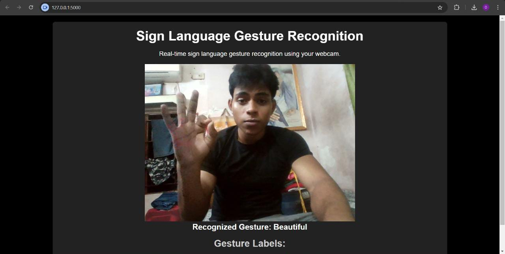

# Real-Time ISL Detection - An Indian ☝ Sign 👋 Language 🖐️ NMF Detection Website.
[]()
[]()
[]()
[]()
[]()
[]()
<br>

# Objective
The objective of this project is to develop a system that accurately captures and interprets non-manual features of Indian Sign Language (ISL), such as facial expressions, head movements, and body gestures, and converts them into text. This will enhance the automatic translation of ISL by incorporating the crucial non-manual elements that convey grammatical structure, emphasis, and emotions, ensuring more precise and meaningful communication.

# About the website
#### This Web App provides:
The Django app for capturing non-manual features of Indian Sign Language (ISL) is designed to process video input, detect facial expressions, head movements, and body gestures, and convert these non-manual features into text. The app utilizes machine learning models integrated with Django’s backend to handle data processing and feature recognition. Users can upload video content, and the app will analyze the non-manual cues in ISL, translating them into meaningful text output. This app aims to enhance accessibility and improve the accuracy of ISL translation by incorporating essential non-manual elements.
<br>
# Website overview

</details>

# Source Data
```
    https://zenodo.org/records/4010759
```

# Preprocessing
- Extract Landmarks: Use MediaPipe's Holistic model or pose detection model to extract key landmarks from the frames of a video.
- Normalization: Normalize the extracted landmark coordinates.
- Augmentation (Optional): Apply data augmentation techniques to increase diversity in your training data.
- Saving Landmarks: Store the processed landmarks in a structured format such as .npy files.


## Installation
To set up and use Sentiment Analyzer in your own project, follow these steps:

- Clone this repository to your local machine.
```
    https://github.com/mohar69/gesture_recognition.git
```
- Install the required dependencies for python 3.9 or above.
```
    pip install -r requirements.txt
```
- Running the Django app
```
    python manage.py runserver
```
